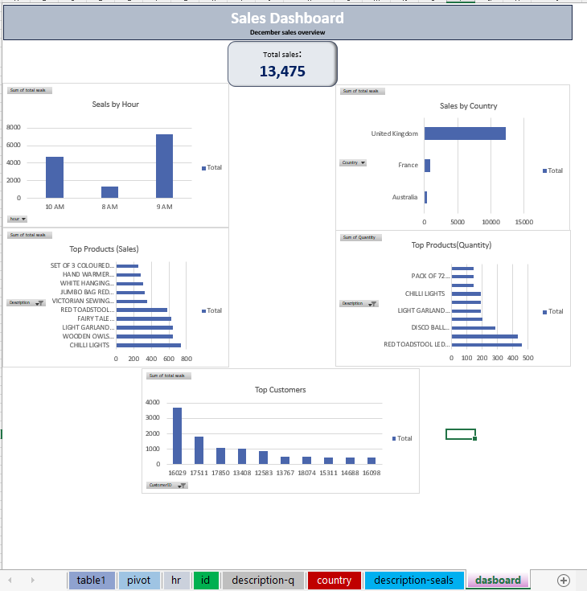

# 📊 Retail Sales Data Analysis

## 📌 Project Overview
This project analyzes retail sales data using Microsoft Excel to identify trends, peak sales hours, and customer behavior.

## 🛠 Tools Used
- Microsoft Excel
- Pivot Tables
- Data Cleaning
- Charts

## 📈 Key Insights
- Peak sales occurred at 9 AM
- Total revenue: 13,475.18
- Sales trends analyzed by time and customers

## 📷 Dashboard

## 📁 Files
- sales-data-analysis.xlsx
